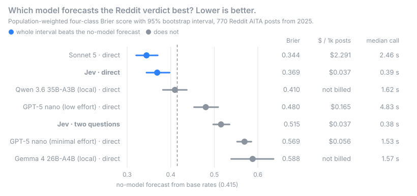

# Jev vs. LLMs on Reddit's "Am I the Asshole?"

**Bottom line:** on weighted Brier score (lower is better), Jev came a narrow
second of seven configurations, behind Sonnet 5 (0.369 vs. 0.344), at 1/62 of
Sonnet's cost and 6.3× its speed. That's fast, but not the "40x-200x faster" TypeSafe
claims.



[Jev](https://typesafe.ai/blog/introducing-system-one-models-and-jev) is
TypeSafe's "System One" model. It doesn't write text: you give it a situation
and a question, and in one fast call it returns a probability for each answer.
TypeSafe says it matches LLMs on quick judgments like this. I tested
`jev-1.13-20260917` on posts from Reddit's r/AmItheAsshole, where readers vote
on who was at fault in a conflict:

| **YTA** | **NTA** | **ESH** | **NAH** |
|---|---|---|---|
| the poster is at fault | the other party is | everyone is | no one is |

The test had two parts. First, Jev alone: find the best way to ask it.
Second, that setup against Sonnet 5, GPT-5 nano and two local open-weight
models, on 770 posts from 2025. Every model gives a probability for each of the
four verdicts, scored against Reddit's verdict.

I have no affiliation with TypeSafe and paid for every call myself (about
$2.75 in total).

## What counts as "correct"

Whether someone is the asshole is an opinion, so there is no true answer
here. What this benchmark measures is narrower: **can a model predict the
verdict Reddit gave?** The target is the post's official verdict flair, which
AITA sets from the verdict in the top-voted comment. A model is "right" when
its most likely verdict matches that flair. The Brier score also gives partial
credit: 70% on the flair's verdict scores better than 30%.

Reddit's verdict is itself noisy. One top comment decides it, even when
the other commenters lean elsewhere. On 704 of the 770 posts, the flair
matches the verdict most commenters gave (weighted by upvotes); on the other
66, the upvoted comments leaned toward a different verdict. Scoring only the
704 clearer posts tells the same story: Jev 63.4% vs. Sonnet 64.3% plain
accuracy ([details](docs/results.md#flair-and-comment-disagreement)). "Not enough info"
posts are left out, since that's not a verdict on anyone.

## Part 1: finding the best way to ask Jev

Jev can take several questions per call, of three types: **yes/no** (returns
one probability), **Choice** (a probability for each option) and **Score** (a
probability for each level of a scale). So "is the poster the asshole?" can be
asked directly, or split into smaller judgments that a combining step turns
into a verdict. I tried eight setups, and **none showed a clear advantage
over asking directly**. The closest, 5 yes/no questions, was within noise
(Brier −0.008, 95% CI −0.026 to +0.010).

<details>
<summary><b>All 8 setups, what Jev was asked, and how each did</b></summary>

These were exploratory comparisons under one fixed regression and
cross-validation setup.

| Setup | Questions per call | What Jev is asked | Result |
|---|---:|---|---|
| **Direct** | 1 Choice | Which verdict would the subreddit reach? (the four verdicts, defined) | **the baseline; used in Part 2** |
| **2023 · 8 facts** | 8 yes/no | Did the poster break an agreement / overreact / ignore someone's boundaries / deceive? Did the other side behave badly / escalate? Are the stakes high? Is the poster leaving things out? | 41.5% vs. 53.0% accuracy for direct, with a hand-written rule; 51.5% with a fitted one |
| **2023 · everything** | 10 | the 8 facts + direct + a 4-level "how badly did the poster behave?" Score | 55.0% vs. 53.0%; the two agreed on 194 of 200 posts (p = 0.22) |
| **Two questions** | 2 yes/no | Would readers blame the poster? Would they blame at least one other person? Answers multiplied into four verdicts | ran in Part 2 for comparison: much worse |
| **5 yes/no** | 5 yes/no | Was the poster within their rights? Did they act harshly? Did someone else act unreasonably? Is it a clash of two fair needs? Is the poster downplaying their part? | no clear difference (Brier −0.008 [−0.026, +0.010]) |
| **2 severity scores** | 2 Score | How wrong was the poster? How wrong was the other party? (none / minor lapse / owes an apology / caused real harm) | no clear difference (+0.009 [−0.006, +0.024]) |
| **5 mixed steps** | 3 Score + 2 Choice | the two severity scores; what the poster did (reasonable & considerate / reasonable but harsh / unreasonable / mostly reacting); what kind of conflict (one side wrong / both bad / fair clash / misunderstanding); how one-sided the account is | no clear difference (+0.001) |
| **5 steps + direct** | 6 | the five steps plus the direct question | no clear difference (+0.002) |

</details>

How the two rounds ran:

- **2023 development runs, before the final benchmark:** 200 posts from an
  older dataset. No split-up version clearly beat direct, so the final run
  used it. Most of the 8-facts deficit came from its hand-written combining
  rule: replacing it with a fitted one raised accuracy from 41.5% to 51.5%,
  against 53.0% for direct.
- **A check after the final benchmark:** 300 unused 2023 posts, 1,500 calls,
  $0.06. It tested whether better-designed step questions could beat direct.
  Each setup's answers were combined by a small logistic regression that never
  saw the post it scored. Direct was put through the same step so the
  comparison is fair: every setup, direct included, gets the same
  recalibration. None clearly beat direct, whether scored at Reddit's verdict
  mix or with all four verdicts weighted equally, and the extra questions cost
  up to 1.5× more. Full tables: [steps-summary.md](runs/diagnostic/steps-summary.md);
  exact question wording: [`steps.py`](jevbench/steps.py).

That combining step is also why every step setup looks better than raw
direct (0.354 on these posts): the gain comes from the recalibration, not from
the extra questions. Recalibrating direct alone gives 0.320, as good as any
setup. It's not a free win, though. Scored at Reddit's mix, the recalibrated
models almost never predict ESH or NAH (0–2% recall); they gain by betting on
the common verdicts. It's post-processing, the chat models would need the
same adjustment to be fair, and it's not in Part 2.

## Part 2: the best Jev setup vs. LLMs

How to read the table:

- **Brier score** grades the four probabilities, from 0 (perfect) to 2.
  Lower is better. A confident wrong answer costs more than a hedged one.
- **Weighted** undoes the sample's deliberate imbalance. On Reddit, 74% of
  verdicts are NTA and about 4% each are ESH and NAH. The sample has about
  twice as many ESH and NAH posts as that, so there are enough to measure.
  Weighting scores each verdict at its real share: an NTA post counts about
  1.6× as much as in a plain average, an ESH post about half as much.
- **Top-1** is plain accuracy: was the most likely verdict the right one?
- **Macro recall** averages the hit rate of each of the four verdicts, so a
  model that always says NTA gets 25%.
- Brackets are 95% intervals from resampling posts. They measure variation
  across posts, not between repeated calls: each model ran once, and at
  temperature 0 a restarted GPT-5 nano run repeated only 64 of 103 answers.

| Model | Weighted Brier ↓ [95% post-bootstrap CI] | Weighted top-1 [95% post-bootstrap CI] | Macro recall | Median call | $ per 1,000 posts |
|---|---:|---:|---:|---:|---:|
| Sonnet 5 | 0.344 [0.321, 0.370] | 76.9% [74.5, 79.1] | 36.1% | 2.46 s | $2.291 |
| **Jev, direct question** | 0.369 [0.344, 0.398] | 75.4% [72.7, 77.8] | 37.4% | 0.39 s | $0.037 |
| Qwen 3.6 35B-A3B, local | 0.410 [0.382, 0.437] | 75.3% [73.3, 77.2] | 30.3% | 1.62 s | not billed |
| GPT-5 nano, low effort | 0.480 [0.454, 0.509] | 66.1% [62.7, 69.4] | 35.5% | 4.83 s | $0.165 |
| Jev, two questions | 0.515 [0.497, 0.535] | 62.6% [59.6, 65.5] | 31.6% | 0.38 s | $0.037 |
| GPT-5 nano, minimal effort | 0.569 [0.552, 0.585] | 57.2% [53.7, 60.8] | 25.9% | 1.53 s | $0.056 |
| Gemma 4 26B-A4B, local | 0.588 [0.539, 0.636] | 58.3% [54.3, 62.3] | 44.4% | 1.57 s | not billed |
| *No model: base rates / always NTA* | *0.415* | *74.0%* | *25.0%* | | |

- **Sonnet 5 was best on this metric; Jev was a close second.** Sonnet's Brier lead is
  0.025 (95% CI 0.003 to 0.046). That clears the 95% interval, but not a
  Bonferroni correction for the five comparisons with Jev, so treat it as
  borderline. On log loss, Sonnet's lead is clearer and does survive the
  correction. Scored unweighted, there's no clear difference (Jev 0.556,
  Sonnet 0.563). Jev beat both GPT-5 nano settings and both local models.
- **Jev was 6× faster than Sonnet, not 40–200×.** Its median call took 0.39 s,
  inside TypeSafe's 70–500 ms claim, and it was 62× cheaper than Sonnet. Against
  GPT-5 nano it was 3.9× faster and 1.5× cheaper than minimal effort, and 12×
  faster and 4.5× cheaper than low effort. TypeSafe's comparison was
  against a model reasoning at its default level; the chat models here did
  little or no reasoning, which makes them much faster.
- **Base rates are hard to beat.** Always answering NTA is right 74% of the
  time. Only Sonnet and Jev beat the base-rate forecast with paired intervals
  that exclude zero (−0.070 and −0.046). Qwen's point estimate was slightly
  better (0.410 vs. 0.415), but inconclusive (−0.005, 95% CI −0.033 to
  +0.022). Every model missed more than half of the ESH and NAH posts.

**Does post-processing narrow Sonnet's lead?** In a planned follow-up using
the saved answers, with no new API calls, each configuration got the same
cross-fitted regression. Sonnet's weighted Brier lead fell from 0.025 to 0.007
(95% post-bootstrap CI −0.021 to +0.007). The regression can change verdict
choices, so this does not isolate calibration. Both models improved on NTA
posts and got worse on YTA, ESH and NAH posts; neither recalibrated model chose
ESH or NAH. The main table still scores their original answers.
[Plan and results](docs/RECALIBRATION_PLAN.md).

Local models ran as 4-bit MLX builds on one laptop; Qwen's 4 malformed answers
count as wrong. More metrics, confusion matrices and calibration are in the
[full results](docs/results.md).

## What this does not show

- **Who is actually right.** Only how well each model predicts Reddit's verdict
  ([see above](#what-counts-as-correct)).
- **Label-only use.** Every model had to give four probabilities, Jev natively
  and the chat models as JSON. Asking a chat model for one label would change
  its accuracy, speed and cost.
- **Full-size local models.** Qwen and Gemma ran as 4-bit builds with reasoning
  off. The prompts also differ slightly: Jev is asked which verdict the
  subreddit would reach, the chat models to predict the official flair.

## Method details

- **Posts:** 770 from UC Berkeley D-Lab's
  [2025 dataset](https://huggingface.co/datasets/ucberkeley-dlab/fragility-moral-judgment-llms)
  (CC BY 4.0, pinned revision): 365 NTA, 285 YTA, 65 ESH and 55 NAH. Models
  saw only the title and text. Posts that state their own verdict ("EDIT:
  seems I'm NTA") were removed. None of the Part 1 posts are among them.
- **Plan:** the [protocol](docs/FINAL_PROTOCOL.md) lists four deviations from
  it, including a parser fix that restarted two runs. Neither the plan nor the
  exact code that ran was committed before the runs, so their timing can't be
  proven from git; the protocol lists what can still be checked.
- **Prompts:** in [`client.py`](jevbench/client.py) and
  [`questions.py`](jevbench/questions.py), pinned by a test and checked against
  billed token counts by [a script](scripts/check_prompt_tokens.py).
- **Intervals:** 95% bootstrap over posts within each verdict. They exclude
  run-to-run variation: at temperature 0, a restarted GPT-5 nano run repeated
  only 64 of 103 answers.
- **Latency:** one laptop in UTC+3, via OpenRouter, one evening. Jev is served
  from the US West Coast, so its times include a long network trip.

More: [methodology](docs/METHODOLOGY.md), [run logs](runs/README.md).

## Try it

Python 3.10+, standard library only. Clone the repo and run from its folder.

Anything that asks Jev live needs an **OpenRouter API key**, because this repo
calls Jev through OpenRouter. Create one at
[openrouter.ai/keys](https://openrouter.ai/keys) and add a little credit; a
dollar covers thousands of calls. Then copy `.env.example` to `.env` and paste
the key in. Rebuilding the results from the logs needs no key.

### Judge a real AITA post

This pulls a random real post, with Reddit's verdict, from the same Hugging
Face dataset, and asks Jev live (two calls, about $0.0001):

```bash
python -m jevbench.show --random
```

One live run, for illustration (not saved; numbers vary between calls):

```
━━ POST 1ilu5ya ━━━━━━━━━━━━━━━━━━━━━━━━━━━━━━━━━━━━━━━━━━━━━━━━━━━━ 3071 chars
  AITA for telling my boyfriend not to bother coming over to my house anymore?
  …
  Forum verdict: NTA (Not the asshole -- the other party is in the wrong)

━━ STEP 1 · Direct question ━━━━━━━━━━━━━━━━━━━━━━━━━━━━━━━━ 553 ms · $0.000047
  Answered: choice NTA, confidence 0.71

  NTA   0.78  ███████████████████████████████  ← picked · forum verdict
  YTA   0.14  ██████
  NAH   0.04  ██
  ESH   0.04  ██

  Jev picked NTA · forum said NTA · ✓ right · Brier 0.071

━━ STEP 2 · Two yes/no questions ━━━━━━━━━━━━━━━━━━━━━━━━━━━ …
```

The post may be one of the 770 benchmark posts; its answer is fetched fresh
either way. To judge your own post instead, pass the text (first line is the
title), or pipe it in with `--text -`:

```bash
python -m jevbench.show --text "AITA for not lending my car to my sister?
She crashed my last one and never paid for the repairs."
```

### Rebuild the results

No key or network needed. This regenerates every table and chart from the
committed logs:

```bash
python -m jevbench.report runs/final-*.jsonl --priors data/final-ucb-2025.source.json --chart docs/headline.svg
```

It rewrites `docs/results.md` without one section (Reddit's verdict against
the comment vote), which needs the posts from the next step. The Part 1 tables
rebuild the same way:

```bash
python -m jevbench.steps fit runs/diagnostic/steps-dev-*.jsonl
```

And the recalibration check (about a minute, no key):

```bash
python -m jevbench.recalibrate
```

### Replay a benchmark post

To see a post from the benchmark next to Jev's logged answer and Reddit's
verdict, first rebuild the 770 posts. This downloads the dataset from the same
Hugging Face API `--random` uses, refuses it if it doesn't
match the pinned hash, and draws the same sample:

```bash
python -m jevbench.sample_2025 --fetch --raw data/ucb-2025-raw.jsonl --out data/final-ucb-2025.jsonl
echo "2f8cae7c7bebe3c259efbe69664b463919a9db5b0db386d23a79d8892f82479d  data/final-ucb-2025.jsonl" | shasum -a 256 -c
```

Then:

```bash
python -m jevbench.show 1hvkncw
```

Leave out the id for the first post, add `--live` to ask Jev again, or
`--short` to print only the post's first lines (this works with `--random` and
`--text` too). With the posts rebuilt, adding
`--source-raw data/ucb-2025-raw.jsonl` to the report command restores its
missing section.

### Run a new benchmark

`python -m jevbench.bench --help`. The runner has a spending cap, and each
run's manifest records the exact prompts.

```
jevbench/   runner, clients, metrics, report, viewer, step setups, recalibration (stdlib only)
scripts/    prompt verification against billed tokens (needs tiktoken)
runs/       final logs; diagnostic/ holds Part 1 and other runs; dev-2023/ the first round
docs/       results, methodology, protocol and charts
tests/      pytest suite, no network
```
