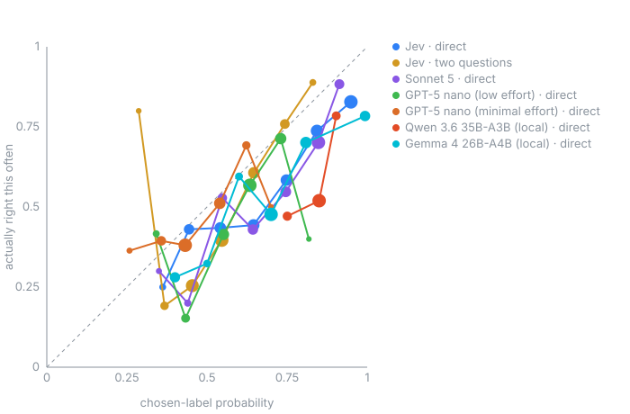

_Generated by `jevbench.report`. 770 posts (285 YTA, 365 NTA, 65 ESH, 55 NAH) · 5390 requests across 7 model and arm pairs._

**5390 requests**, 0 failed · **$1.9919** total · 4,577,375 tokens · sample SHA-256 `2f8cae7c7beb`

Served by: `anthropic/claude-sonnet-5`, `google/gemma-4-26b-a4b-qat`, `openai/gpt-5-nano`, `qwen/qwen3.6-35b-a3b`, `typesafe/jev-1.13-20260917`

### Primary score: four-way probabilities

| Model and arm | Scored / successful | Weighted Brier ↓ [95% CI] | Weighted log loss ↓ | Weighted top-1 [95% CI] | Macro recall | Sample Brier ↓ | Sample log loss ↓ | Sample top-1 |
|---|---:|---:|---:|---:|---:|---:|---:|---:|
| Jev · direct | 770/770 | 0.369 [0.344, 0.398] | 0.838 | 75.4% [72.7%, 77.8%] | 37.4% | 0.556 | 1.310 | 60.5% |
| Jev · two questions | 770/770 | 0.515 [0.497, 0.535] | 0.998 | 62.6% [59.6%, 65.5%] | 31.6% | 0.704 | 1.381 | 43.8% |
| Sonnet 5 · direct | 770/770 | 0.344 [0.321, 0.370] | 0.689 | 76.9% [74.5%, 79.1%] | 36.1% | 0.563 | 1.070 | 61.4% |
| GPT-5 nano (low effort) · direct | 770/770 | 0.480 [0.454, 0.509] | 0.951 | 66.1% [62.7%, 69.4%] | 35.5% | 0.636 | 1.245 | 52.1% |
| GPT-5 nano (minimal effort) · direct | 770/770 | 0.569 [0.552, 0.585] | 1.039 | 57.2% [53.7%, 60.8%] | 25.9% | 0.660 | 1.204 | 44.7% |
| Qwen 3.6 35B-A3B (local) · direct | 766/770 | 0.410 [0.382, 0.437] | 1.660 | 75.3% [73.3%, 77.2%] | 30.3% | 0.724 | 3.097 | 54.8% |
| Gemma 4 26B-A4B (local) · direct | 770/770 | 0.588 [0.539, 0.636] | 2.663 | 58.3% [54.3%, 62.3%] | 44.4% | 0.659 | 3.295 | 54.8% |

_Weighted scores use class frequencies among eligible four-flair source posts. Intervals resample posts within each class. Macro recall is the unweighted mean of the four class recalls. Malformed answers count as wrong for top-1 and recall and are left out of Brier and log loss. Log loss clips the true-class probability at 1e-15, so a zero on the true class costs about 34.5 instead of infinity._

### Paired comparison with Jev's direct arm

| Model and arm | Paired posts | Weighted Brier Δ [95% CI] | Weighted log loss Δ [95% CI] | Unweighted Brier Δ [95% CI] | Check |
|---|---:|---:|---:|---:|---|
| Sonnet 5 · direct | 770 | -0.025 [-0.046, -0.003] | -0.149 [-0.259, -0.053] | +0.007 [-0.018, +0.031] | 0 unpaired or invalid |
| GPT-5 nano (low effort) · direct | 770 | +0.111 [+0.084, +0.139] | +0.113 [-0.002, +0.223] | +0.081 [+0.050, +0.112] | 0 unpaired or invalid |
| GPT-5 nano (minimal effort) · direct | 770 | +0.200 [+0.172, +0.230] | +0.201 [+0.086, +0.308] | +0.104 [+0.067, +0.139] | 0 unpaired or invalid |
| Qwen 3.6 35B-A3B (local) · direct | 766 | +0.042 [+0.014, +0.072] | +0.844 [+0.671, +1.001] | +0.172 [+0.136, +0.206] | 4 unpaired or invalid |
| Gemma 4 26B-A4B (local) · direct | 770 | +0.219 [+0.179, +0.259] | +1.825 [+1.336, +2.377] | +0.103 [+0.065, +0.143] | 0 unpaired or invalid |

_Positive means worse than Jev. Only posts where both models gave a valid distribution are paired._

### No-model baselines

| No-model baseline | Weighted Brier ↓ | Weighted log loss ↓ | Weighted accuracy | Macro recall |
|---|---:|---:|---:|---:|
| Source-prior probabilities | 0.415 | 0.779 | 74.0% | 25.0% |
| Always NTA | 0.520 | 8.977 | 74.0% | 25.0% |

### Accuracy, latency and cost

| Model and arm | Q/call | Sample accuracy | vs. sample majority | Stratified-sample chosen-label ECE ↓ | ECE support | p50 | p95 | $/1k posts | Unparseable |
|---|---|---|---|---|---|---|---|---|---|
| Jev · direct | 1 | 60.5% | +13.1 pp | 0.124 | 7 bins, min 12 | 391 ms | 508 ms | $0.037 | 0 |
| Jev · two questions | 2 | 43.8% | -3.6 pp | 0.130 | 7 bins, min 5 | 377 ms | 488 ms | $0.037 | 0 |
| Sonnet 5 · direct | 1 | 61.4% | +14.0 pp | 0.138 | 7 bins, min 10 | 2464 ms | 2916 ms | $2.291 | 0 |
| GPT-5 nano (low effort) · direct | 1 | 52.1% | +4.7 pp | 0.094 | 6 bins, min 5 | 4825 ms | 7468 ms | $0.165 | 0 |
| GPT-5 nano (minimal effort) · direct | 1 | 44.7% | -2.7 pp | 0.047 | 6 bins, min 10 | 1533 ms | 2519 ms | $0.056 | 0 |
| Qwen 3.6 35B-A3B (local) · direct | 1 | 54.8% | +7.4 pp | 0.289 | 3 bins, min 116 | 1623 ms | 1990 ms | $0.000 | 4 |
| Gemma 4 26B-A4B (local) · direct | 1 | 54.8% | +7.4 pp | 0.165 | 6 bins, min 34 | 1571 ms | 1997 ms | $0.000 | 0 |

### Flair and comment disagreement

Official flair matches the vote-weighted four-verdict plurality on 704/770 posts (275 YTA, 343 NTA, 47 ESH, 39 NAH); 0 ties. The unweighted plurality matches on 613/770 posts, with 13 ties. INFO is excluded.

| Model and arm | Posts | Sample accuracy | Brier coverage | Sample Brier ↓ |
|---|---:|---:|---:|---:|
| Jev · direct | 704 | 63.4% | 704/704 | 0.516 |
| Jev · two questions | 704 | 44.5% | 704/704 | 0.697 |
| Sonnet 5 · direct | 704 | 64.3% | 704/704 | 0.520 |
| GPT-5 nano (low effort) · direct | 704 | 53.4% | 704/704 | 0.619 |
| GPT-5 nano (minimal effort) · direct | 704 | 46.2% | 704/704 | 0.644 |
| Qwen 3.6 35B-A3B (local) · direct | 704 | 56.8% | 700/704 | 0.689 |
| Gemma 4 26B-A4B (local) · direct | 704 | 57.1% | 704/704 | 0.629 |

_The reliability plot, ECE, and confidence-gating table are unweighted descriptive results for the stratified sample. They are not estimates for the eligible-source class mix._

### Two-question cost and latency

| Model | Questions | p50 latency | Latency ratio | $/1k | Cost ratio |
|---|---|---|---|---|---|
| Jev | 1→2 | 391 → 377 ms | 0.97× | $0.037 → $0.037 | 0.99× |

### Where it goes wrong

**Jev · direct.** Rows are Reddit's verdict; columns are the model's.

| | YTA | NTA | ESH | NAH | recall |
|---|---|---|---|---|---|
| **YTA** | **131** | 135 | 1 | 18 | 46% |
| **NTA** | 35 | **327** | 0 | 3 | 90% |
| **ESH** | 12 | 51 | **2** | 0 | 3% |
| **NAH** | 13 | 36 | 0 | **6** | 11% |

**Jev · two questions.** Rows are Reddit's verdict; columns are the model's.

| | YTA | NTA | ESH | NAH | recall |
|---|---|---|---|---|---|
| **YTA** | **16** | 133 | 135 | 1 | 6% |
| **NTA** | 0 | **296** | 69 | 0 | 81% |
| **ESH** | 1 | 43 | **21** | 0 | 32% |
| **NAH** | 5 | 40 | 6 | **4** | 7% |

**Sonnet 5 · direct.** Rows are Reddit's verdict; columns are the model's.

| | YTA | NTA | ESH | NAH | recall |
|---|---|---|---|---|---|
| **YTA** | **135** | 144 | 6 | 0 | 47% |
| **NTA** | 23 | **335** | 7 | 0 | 92% |
| **ESH** | 14 | 50 | **1** | 0 | 2% |
| **NAH** | 12 | 41 | 0 | **2** | 4% |

**GPT-5 nano (low effort) · direct.** Rows are Reddit's verdict; columns are the model's.

| | YTA | NTA | ESH | NAH | recall |
|---|---|---|---|---|---|
| **YTA** | **93** | 158 | 7 | 27 | 33% |
| **NTA** | 37 | **291** | 13 | 24 | 80% |
| **ESH** | 16 | 43 | **5** | 1 | 8% |
| **NAH** | 11 | 32 | 0 | **12** | 22% |

**GPT-5 nano (minimal effort) · direct.** Rows are Reddit's verdict; columns are the model's.

| | YTA | NTA | ESH | NAH | recall |
|---|---|---|---|---|---|
| **YTA** | **89** | 188 | 8 | 0 | 31% |
| **NTA** | 110 | **253** | 2 | 0 | 69% |
| **ESH** | 17 | 46 | **2** | 0 | 3% |
| **NAH** | 11 | 44 | 0 | 0 | 0% |

**Qwen 3.6 35B-A3B (local) · direct.** Rows are Reddit's verdict; columns are the model's.

| | YTA | NTA | ESH | NAH | UNPARSED | recall |
|---|---|---|---|---|---|---|
| **YTA** | **75** | 208 | 0 | 0 | 2 | 26% |
| **NTA** | 17 | **347** | 0 | 0 | 1 | 95% |
| **ESH** | 8 | 56 | 0 | 0 | 1 | 0% |
| **NAH** | 5 | 50 | 0 | 0 | 0 | 0% |

**Gemma 4 26B-A4B (local) · direct.** Rows are Reddit's verdict; columns are the model's.

| | YTA | NTA | ESH | NAH | recall |
|---|---|---|---|---|---|
| **YTA** | **164** | 47 | 22 | 52 | 58% |
| **NTA** | 62 | **224** | 37 | 42 | 61% |
| **ESH** | 20 | 25 | **11** | 9 | 17% |
| **NAH** | 16 | 11 | 5 | **23** | 42% |

### Confidence-gated routing

| Model and arm | Chosen-label p ≥ | Coverage | Accuracy when it acts |
|---|---|---|---|
| Jev · direct | 0.50 | 88.2% | 63.2% |
| Jev · direct | 0.70 | 57.1% | 73.6% |
| Jev · direct | 0.90 | 24.2% | 82.8% |
| Jev · direct | 0.95 | 12.6% | 87.6% |
| Jev · two questions | 0.50 | 64.7% | 53.8% |
| Jev · two questions | 0.70 | 13.1% | 78.2% |
| Jev · two questions | 0.90 | 0.0% | n/a |
| Jev · two questions | 0.95 | 0.0% | n/a |
| Sonnet 5 · direct | 0.50 | 95.5% | 63.3% |
| Sonnet 5 · direct | 0.70 | 68.2% | 69.7% |
| Sonnet 5 · direct | 0.90 | 13.4% | 88.3% |
| Sonnet 5 · direct | 0.95 | 0.8% | 100.0% |
| GPT-5 nano (low effort) · direct | 0.50 | 87.5% | 56.4% |
| GPT-5 nano (low effort) · direct | 0.70 | 23.8% | 70.5% |
| GPT-5 nano (low effort) · direct | 0.90 | 0.0% | n/a |
| GPT-5 nano (low effort) · direct | 0.95 | 0.0% | n/a |
| GPT-5 nano (minimal effort) · direct | 0.50 | 37.7% | 55.2% |
| GPT-5 nano (minimal effort) · direct | 0.70 | 1.3% | 50.0% |
| GPT-5 nano (minimal effort) · direct | 0.90 | 0.0% | n/a |
| GPT-5 nano (minimal effort) · direct | 0.95 | 0.0% | n/a |
| Qwen 3.6 35B-A3B (local) · direct | 0.50 | 99.5% | 55.1% |
| Qwen 3.6 35B-A3B (local) · direct | 0.70 | 99.5% | 55.1% |
| Qwen 3.6 35B-A3B (local) · direct | 0.90 | 15.1% | 78.4% |
| Qwen 3.6 35B-A3B (local) · direct | 0.95 | 1.0% | 100.0% |
| Gemma 4 26B-A4B (local) · direct | 0.50 | 85.2% | 59.5% |
| Gemma 4 26B-A4B (local) · direct | 0.70 | 75.3% | 61.0% |
| Gemma 4 26B-A4B (local) · direct | 0.90 | 16.2% | 78.4% |
| Gemma 4 26B-A4B (local) · direct | 0.95 | 15.2% | 78.6% |

_The reliability plot, ECE, and confidence-gating table are unweighted descriptive results for the stratified sample. They are not estimates for the eligible-source class mix._

### Cost, speed and failures

| Model and arm | Requests | Failed | Retried | Tokens | Spend | $/1k posts | API time |
|---|---|---|---|---|---|---|---|
| Jev · direct | 770 | 0 | 0 | 713,469 | $0.0285 | $0.037 | 308s |
| Jev · two questions | 770 | 0 | 0 | 702,689 | $0.0282 | $0.037 | 300s |
| Sonnet 5 · direct | 770 | 0 | 0 | 740,451 | $1.7643 | $2.291 | 1938s |
| GPT-5 nano (low effort) · direct | 770 | 0 | 0 | 755,188 | $0.1274 | $0.165 | 3888s |
| GPT-5 nano (minimal effort) · direct | 770 | 0 | 0 | 545,323 | $0.0435 | $0.056 | 1330s |
| Qwen 3.6 35B-A3B (local) · direct | 770 | 0 | 0 | 561,603 | $0.0000 | $0.000 | 1196s |
| Gemma 4 26B-A4B (local) · direct | 770 | 0 | 0 | 558,652 | $0.0000 | $0.000 | 1232s |
