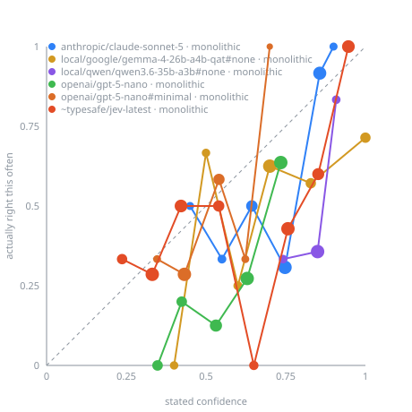

_Generated by `jevbench.report`. 40 posts · {'yta': 14, 'nta': 14, 'nah': 6, 'esh': 6} · 240 requests across 6 model(s)._

**240 requests**, 0 failed · **$0.1012** total · 201,641 tokens · 371s wall · commit `e473a91` · seed 20260922

Served by: `anthropic/claude-sonnet-5`, `google/gemma-4-26b-a4b-qat`, `openai/gpt-5-nano`, `qwen/qwen3.6-35b-a3b`, `typesafe/jev-1.13-20260917`

### Headline

| Model | Arm | Q/call | Verdict accuracy | vs. majority verdict | Confidence ECE ↓ | ECE support | p50 | p95 | $/1k posts | Unparseable |
|---|---|---|---|---|---|---|---|---|---|---|
| `anthropic/claude-sonnet-5` | monolithic | 1 | 57.5% | +22.5 pp | 0.214 | 6 bins, min 2 | 2416 ms | 2746 ms | $2.272 | 0 |
| `local/google/gemma-4-26b-a4b-qat#none` | monolithic | 1 | 55.0% | +20.0 pp | 0.202 | 6 bins, min 3 | 1593 ms | 1977 ms | $0.000 | 0 |
| `local/qwen/qwen3.6-35b-a3b#none` | monolithic | 1 | 42.5% | +7.5 pp | 0.417 | 3 bins, min 6 | 1711 ms | 1963 ms | $0.000 | 0 |
| `openai/gpt-5-nano` | monolithic | 1 | 30.0% | -5.0 pp | 0.278 | 5 bins, min 5 | 4545 ms | 6884 ms | $0.164 | 0 |
| `openai/gpt-5-nano#minimal` | monolithic | 1 | 40.0% | +5.0 pp | 0.120 | 5 bins, min 1 | 1622 ms | 2124 ms | $0.057 | 0 |
| `~typesafe/jev-latest` | monolithic | 1 | 50.0% | +15.0 pp | 0.161 | 8 bins, min 2 | 379 ms | 504 ms | $0.037 | 0 |

### Four-way probabilities

| Model | Arm | Scored / successful | Brier ↓ | Log loss ↓ | Top-1 |
|---|---|---:|---:|---:|---:|
| `anthropic/claude-sonnet-5` | monolithic | 40/40 | 0.616 | 1.203 | 57.5% |
| `local/google/gemma-4-26b-a4b-qat#none` | monolithic | 40/40 | 0.643 | 3.506 | 55.0% |
| `local/qwen/qwen3.6-35b-a3b#none` | monolithic | 40/40 | 0.926 | 5.568 | 42.5% |
| `openai/gpt-5-nano` | monolithic | 40/40 | 0.802 | 1.541 | 30.0% |
| `openai/gpt-5-nano#minimal` | monolithic | 40/40 | 0.723 | 1.345 | 40.0% |
| `~typesafe/jev-latest` | monolithic | 40/40 | 0.687 | 1.285 | 50.0% |

_Population weights unavailable; scores reflect this sample's class mix._

### Paired monolithic comparison

| Model | Paired posts | Brier Δ vs Jev | 95% bootstrap CI | Check |
|---|---:|---:|---:|---|
| `anthropic/claude-sonnet-5` | 40 | -0.070 | [-0.212, +0.070] | paired with `~typesafe/jev-latest` |
| `local/google/gemma-4-26b-a4b-qat#none` | 40 | -0.044 | [-0.181, +0.091] | paired with `~typesafe/jev-latest` |
| `local/qwen/qwen3.6-35b-a3b#none` | 40 | +0.240 | [+0.046, +0.437] | paired with `~typesafe/jev-latest` |
| `openai/gpt-5-nano` | 40 | +0.115 | [-0.025, +0.256] | paired with `~typesafe/jev-latest` |
| `openai/gpt-5-nano#minimal` | 40 | +0.036 | [-0.117, +0.190] | paired with `~typesafe/jev-latest` |

### Does decomposition pay? (Speculative Fan-Out)

_Needs the monolithic arm plus at least one other for the same model._

### Where it goes wrong

**`anthropic/claude-sonnet-5` · monolithic** — rows are Reddit's verdict, columns the model's

| | YTA | NTA | ESH | NAH | recall |
|---|---|---|---|---|---|
| **YTA** | **7** | 7 | 0 | 0 | 50% |
| **NTA** | 0 | **14** | 0 | 0 | 100% |
| **ESH** | 2 | 2 | **2** | 0 | 33% |
| **NAH** | 1 | 5 | 0 | 0 | 0% |

**`local/google/gemma-4-26b-a4b-qat#none` · monolithic** — rows are Reddit's verdict, columns the model's

| | YTA | NTA | ESH | NAH | recall |
|---|---|---|---|---|---|
| **YTA** | **10** | 0 | 1 | 3 | 71% |
| **NTA** | 2 | **11** | 1 | 0 | 79% |
| **ESH** | 4 | 2 | 0 | 0 | 0% |
| **NAH** | 2 | 2 | 1 | **1** | 17% |

**`local/qwen/qwen3.6-35b-a3b#none` · monolithic** — rows are Reddit's verdict, columns the model's

| | YTA | NTA | ESH | NAH | recall |
|---|---|---|---|---|---|
| **YTA** | **3** | 11 | 0 | 0 | 21% |
| **NTA** | 0 | **14** | 0 | 0 | 100% |
| **ESH** | 3 | 3 | 0 | 0 | 0% |
| **NAH** | 0 | 6 | 0 | 0 | 0% |

**`openai/gpt-5-nano` · monolithic** — rows are Reddit's verdict, columns the model's

| | YTA | NTA | ESH | NAH | recall |
|---|---|---|---|---|---|
| **YTA** | **1** | 10 | 2 | 1 | 7% |
| **NTA** | 0 | **10** | 1 | 3 | 71% |
| **ESH** | 4 | 1 | **1** | 0 | 17% |
| **NAH** | 2 | 4 | 0 | 0 | 0% |

**`openai/gpt-5-nano#minimal` · monolithic** — rows are Reddit's verdict, columns the model's

| | YTA | NTA | ESH | NAH | recall |
|---|---|---|---|---|---|
| **YTA** | **5** | 8 | 0 | 1 | 36% |
| **NTA** | 3 | **11** | 0 | 0 | 79% |
| **ESH** | 5 | 1 | 0 | 0 | 0% |
| **NAH** | 1 | 5 | 0 | 0 | 0% |

**`~typesafe/jev-latest` · monolithic** — rows are Reddit's verdict, columns the model's

| | YTA | NTA | ESH | NAH | recall |
|---|---|---|---|---|---|
| **YTA** | **6** | 7 | 0 | 1 | 43% |
| **NTA** | 2 | **12** | 0 | 0 | 86% |
| **ESH** | 4 | 2 | 0 | 0 | 0% |
| **NAH** | 2 | 2 | 0 | **2** | 33% |

### Score question: severity

_No Score question in this run._

### Confidence-gated routing

| Model | Arm | Confidence ≥ | Coverage | Accuracy when it acts |
|---|---|---|---|---|
| `anthropic/claude-sonnet-5` | monolithic | 0.50 | 95.0% | 57.9% |
| `anthropic/claude-sonnet-5` | monolithic | 0.70 | 67.5% | 63.0% |
| `anthropic/claude-sonnet-5` | monolithic | 0.90 | 5.0% | 100.0% |
| `anthropic/claude-sonnet-5` | monolithic | 0.95 | 0.0% | n/a |
| `local/google/gemma-4-26b-a4b-qat#none` | monolithic | 0.50 | 92.5% | 59.5% |
| `local/google/gemma-4-26b-a4b-qat#none` | monolithic | 0.70 | 75.0% | 63.3% |
| `local/google/gemma-4-26b-a4b-qat#none` | monolithic | 0.90 | 17.5% | 71.4% |
| `local/google/gemma-4-26b-a4b-qat#none` | monolithic | 0.95 | 17.5% | 71.4% |
| `local/qwen/qwen3.6-35b-a3b#none` | monolithic | 0.50 | 100.0% | 42.5% |
| `local/qwen/qwen3.6-35b-a3b#none` | monolithic | 0.70 | 100.0% | 42.5% |
| `local/qwen/qwen3.6-35b-a3b#none` | monolithic | 0.90 | 15.0% | 83.3% |
| `local/qwen/qwen3.6-35b-a3b#none` | monolithic | 0.95 | 2.5% | 0.0% |
| `openai/gpt-5-nano` | monolithic | 0.50 | 75.0% | 36.7% |
| `openai/gpt-5-nano` | monolithic | 0.70 | 27.5% | 63.6% |
| `openai/gpt-5-nano` | monolithic | 0.90 | 0.0% | n/a |
| `openai/gpt-5-nano` | monolithic | 0.95 | 0.0% | n/a |
| `openai/gpt-5-nano#minimal` | monolithic | 0.50 | 40.0% | 56.2% |
| `openai/gpt-5-nano#minimal` | monolithic | 0.70 | 2.5% | 100.0% |
| `openai/gpt-5-nano#minimal` | monolithic | 0.90 | 0.0% | n/a |
| `openai/gpt-5-nano#minimal` | monolithic | 0.95 | 0.0% | n/a |
| `~typesafe/jev-latest` | monolithic | 0.50 | 60.0% | 58.3% |
| `~typesafe/jev-latest` | monolithic | 0.70 | 45.0% | 66.7% |
| `~typesafe/jev-latest` | monolithic | 0.90 | 15.0% | 100.0% |
| `~typesafe/jev-latest` | monolithic | 0.95 | 7.5% | 100.0% |

### Cost, speed and failures

| Model | Arm | Requests | Failed | Retried | Tokens | Spend | $/1k posts | API time |
|---|---|---|---|---|---|---|---|---|
| `anthropic/claude-sonnet-5` | monolithic | 40 | 0 | 0 | 38,080 | $0.0909 | $2.272 | 97s |
| `local/google/gemma-4-26b-a4b-qat#none` | monolithic | 40 | 0 | 0 | 29,094 | $0.0000 | $0.000 | 63s |
| `local/qwen/qwen3.6-35b-a3b#none` | monolithic | 40 | 0 | 0 | 29,375 | $0.0000 | $0.000 | 68s |
| `openai/gpt-5-nano` | monolithic | 40 | 0 | 0 | 39,298 | $0.0066 | $0.164 | 191s |
| `openai/gpt-5-nano#minimal` | monolithic | 40 | 0 | 0 | 28,596 | $0.0023 | $0.057 | 67s |
| `~typesafe/jev-latest` | monolithic | 40 | 0 | 0 | 37,198 | $0.0015 | $0.037 | 16s |
